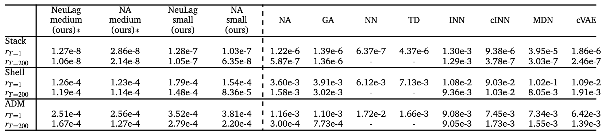
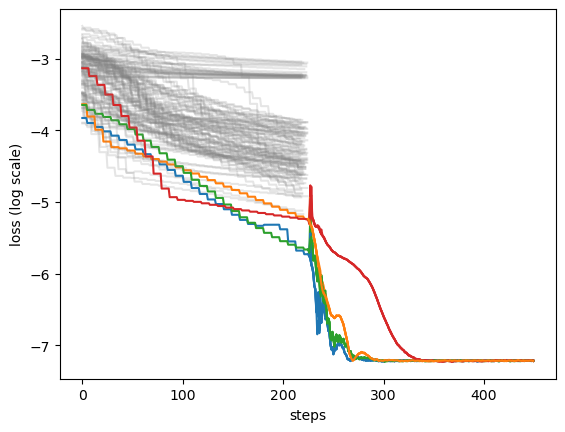

# Enhancing Inverse Problem Solutions with Accurate Surrogate Simulators and Promising Candidates

This repository is the implementation of [Enhancing Inverse Problem Solutions with Accurate Surrogate Simulators and Promising Candidates](???).


## Project Organization

```
    ├── .github/           <- Settings for GitHub.
    │
    ├── images/            <- image files for the README.md
    │
    ├── data/              <- Datasets.
    │
    ├── models/            <- Pretrained surrogate models.
    │
    ├── outputs/           <- Outputs.
    │
    ├── workspace/         <- workspace and a script.
    │
    ├── notebook/          <- a notebook for a demonstration
    │
    ├── src/               <- Source code. This sould be Python module.
    │
    ├── LICENSE            <- MIT Lisense
    │
    └── README.md          <-  a project description

```

## Prerequisites

- pytorch-lightning >= 1.7.1
- torch >= 1.12.1

## main results

We investigated the relationship between the accuracy of the surrogate simulator and the solutions’ quality. Finally, we found that the better the accuracy of the surrogate simulator, we got better the solutions (lower re-simulation error $L_{Resim}$ ).

| | [ref](https://arxiv.org/pdf/2112.10254.pdf) | base | small | medium |
|---|---|---|---|---|
surrogate simulator loss | 2.31e-6 | 3.67e-6 | 3.90e-7 | 7.11e-8|
NA $L_{Resim}$ | 1.22e-6 | 1.28e-6 | 1.03e-7 |2.86e-8|
Neural Lagrangian $L_{Resim}$ | - |1.27e-6|1.28e-7|1.27e-8|


We succeeded in reducing the re-simulation error of the previous method from 1/5 to 1/50 for the three AEM tasks of Stack, Shell, and ADM.



## How to use 


### 1. Generating the dataset

You can generate the datatasets with using the codes in `./data/` directory. Note that these codes are based on [this repository](https://github.com/BensonRen/AEM_DIM_Bench).

#### 1.1 Stack dataset
First, move on `./data/Stack` and run this script. This script creates train dataset for base and small surrogate models and test dataset for inverse problem. If you want to create the dataset for medium surrogate model that needs x4 size dataset, you should remove the comment out.


```
python generate_Stack.py
```


#### 1.2 Shell dataset

First, move on `./data/Shell` and run this script. This script creates train dataset for base and small surrogate models and test dataset for inverse problem. If you want to create the dataset for medium surrogate model that needs x4 size dataset, you should remove the comment out.

```
python generate_Shell.py
```


#### 1.3 Stack dataset

First, download [these files](https://figshare.com/articles/dataset/Dataset_ADM_neural_simulator_for_Inverse_deep_learning_methods_and_benchmarks_for_artificial_electromagnetic_material_design_/17949758/1) and put them on `./src/simulators/data4yang`. Please see details in [this repository](https://github.com/BensonRen/AEM_DIM_Bench).
Second, move on `./data/ADM` and run this script.  This script creates train dataset for base and small surrogate models and test dataset for inverse problem. If you want to create the dataset for medium surrogate model that needs x4 size dataset, you should remove the comment out.


```
python generate_ADM.py
```


### 2. train surrogate models and solving the inverse problems.

 The `./workspace/main.py` is a main script file. This script reads a yaml config file: `f"NA_{task}_{model_name}-model_config.yaml"` for NA method; `f"NeuralLagrangian_{task}_{model_name}-model_config.yaml"` for Neural Lagrangian method. These configs are in `./workspace/configs/`. 

At first, __You need to fill in the "`general - master_dir`" in the yaml file with the root directory of this repository.__ And then, move on `./workspace/` and run this script.


```
python main.py
```

You can choose a task or a surrogate model by modifying `task` and `model_name` in the `main.py`.

```python
if __name__ == "__main__":
    task = "Stack" # "ADM" or "Stack" or "Shell"
    model_name = "base" # "base" or "small" or "medium"

    baseline_test(
        task=task,
        model_name=model_name,
        test_run_mode=False,
    )   

```


if you want to re-train the surrogate model, you can make `fw_model - model_rewrite` option `true` from `false`.


## OUTPUT files

After optimization with `workspace/main.py`, you will get a csv file: `f"NA_{task}_{model_name}-{constraint}_config.yaml"`. if your set `num_T_samples` to $200$ in your config, you can calculate $r_{T=200}$ value by averaging the column `size2048-resim_T` for each method in the csv file. Similarly, averaging column A yields the value of B.Similarly, averaging column `size2048-resim_1` for each method yields the value of $r_{T=1}$ .

Each spectrum result is in `./output` directory. For example, you solving the inverse problem with Stack task spectrum No.1, trial 0, Neural Lagrangian method, base surrogate model and without no constraint. You can find the result in `./output/Stack/ID-1_No-constrain__base-model_trial-0`.

# Visualizing optimization history of solution candidates.
see details in `notebook/VisualizationDemo.ipynb`



## config files

```yaml
general:
  data_dir: data/ADM # data dir
  exp_name: test # experiment name. This value will be overwritten in workspace/main.py
  master_dir: your_path # repository root path
  skip_done_exp: false # if true, rewrite the spectrum result
  task: ADM # task name
output_dirs: {} # output directories. see src/utils/config.py
simulator_files_dir: # simualtor files' directory
  ADM: src/simulators/data4yang/ 
  Stack: src/simulators/stack
fw_model: # surrogate model settings
  model_rewrite: false # if true, re-train surrogate model
  model_name: small # surrogate model name: base, small or medium
fw_train: # settings for the surrogate model training
  batch_size: 64 
  lr: 0.01
  eps: 1e-5
  optimizer: Adam
  decay_factor: 0.2
  decay_patience: 10
  grad_clip: 0.5
  decay_method: ReduceLROnPlateau
  max_epochs: 300
inverse_problem: # settings for the inverse problem optimization
  num_T_samples: 200 #$ the T of r_{T}$
  num_eval_sample_list: [2048] # the number of samples to evaluate
  target_id: 0 # target id. This value will be overwritten by method_test fucntion in workspace/main.py
  input_boundary: # constraint
    ConstrainEqId: No_data
    ConstrainNMId: No_data
    input_boundary: No_data
    target_val: 0.0 # a value for soft constraint
    type: No_data
  method: NeuralLagrangian # NeuralLagrangian or NA
  method_parameters:
    BL_coef: 0.1 # Boundary loss coef
    constrain_loss_coef: 1.0 # strenght of the soft constraing
    eps: 1e-8
    grad_clip: 1.0
    iv_batch_size: 2048
    iv_decay_method: ReduceLROnPlateau
    iv_lr: 0.01
    iv_lr_decay_factor: 0.2
    iv_lr_decay_patience: 30
    optimization_mode: single_target_for_multi_solution
    optimization_steps: 300
  proj: # the settings for a projector network
    input_dim: 128
    mid_layer_dim: 256
    momentum_mu: 0.9
    noise_injection: true
    noise_scale: 0.001
    num_branch: 2048
    num_leanable_input: 8192 # the number of candidates
    num_mid_layers: 2
    reduction_schedule: [4,64,1]
```
